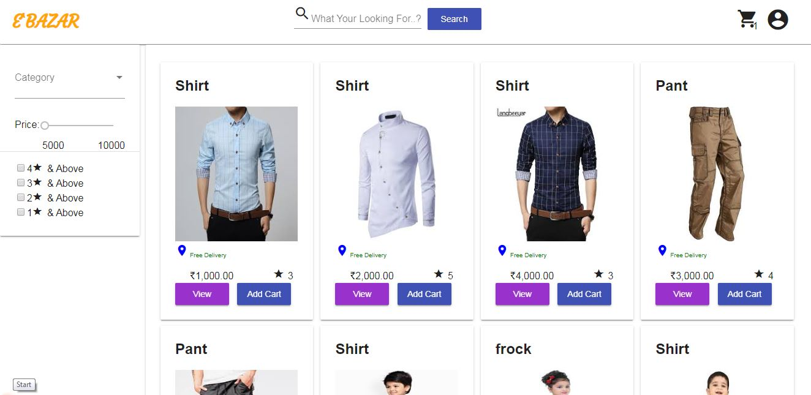
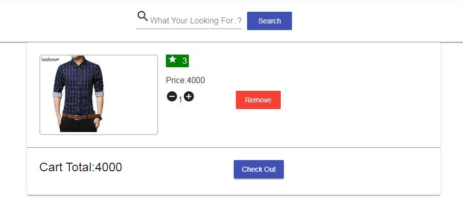

# Ebazar
This is a prototype project for simple e-commerce application for begginers to uderstand the basic concepts of Angular. 
Home Page Looks Something Like This:

This project was generated with [Angular CLI](https://github.com/angular/angular-cli) version 6.2.9.

## Code scaffolding

let's create one new component using `ng generate component component-name`.

Cart Page Looks :

## Build

Run the command `ng build` to build the project. The build artifacts will be stored in the `dist/` directory. Use the `--prod` flag for a production build.

## Running unit tests

Run `ng test` to execute the unit tests via [Karma](https://karma-runner.github.io).

## Running end-to-end tests

Run `ng e2e` to execute the end-to-end tests via [Protractor](http://www.protractortest.org/).

## Further help

To get more help reach out to: rajashekhar.ypattar@gmail.com
